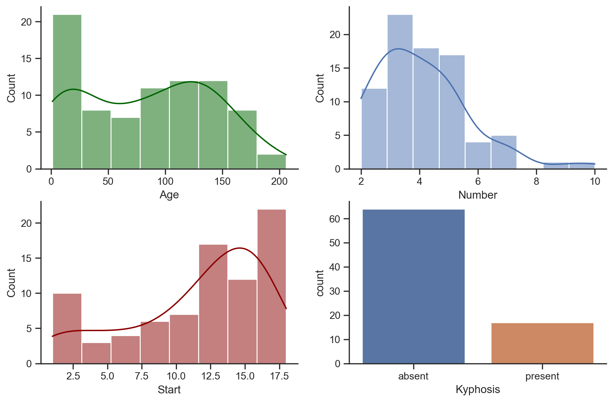
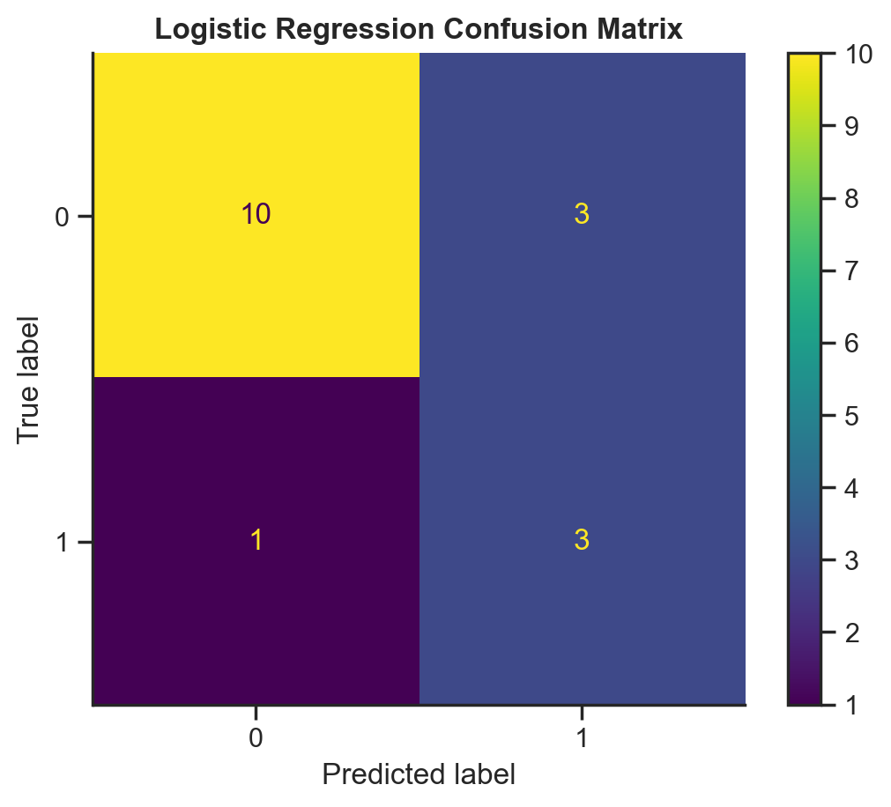
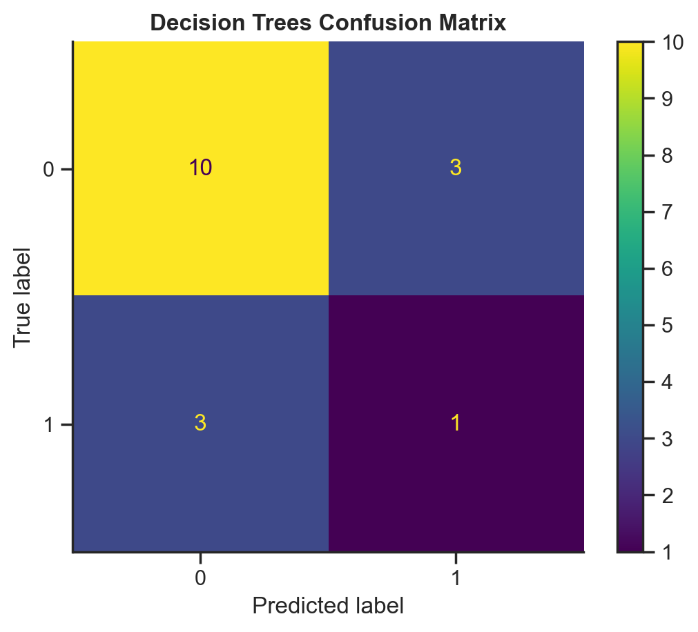
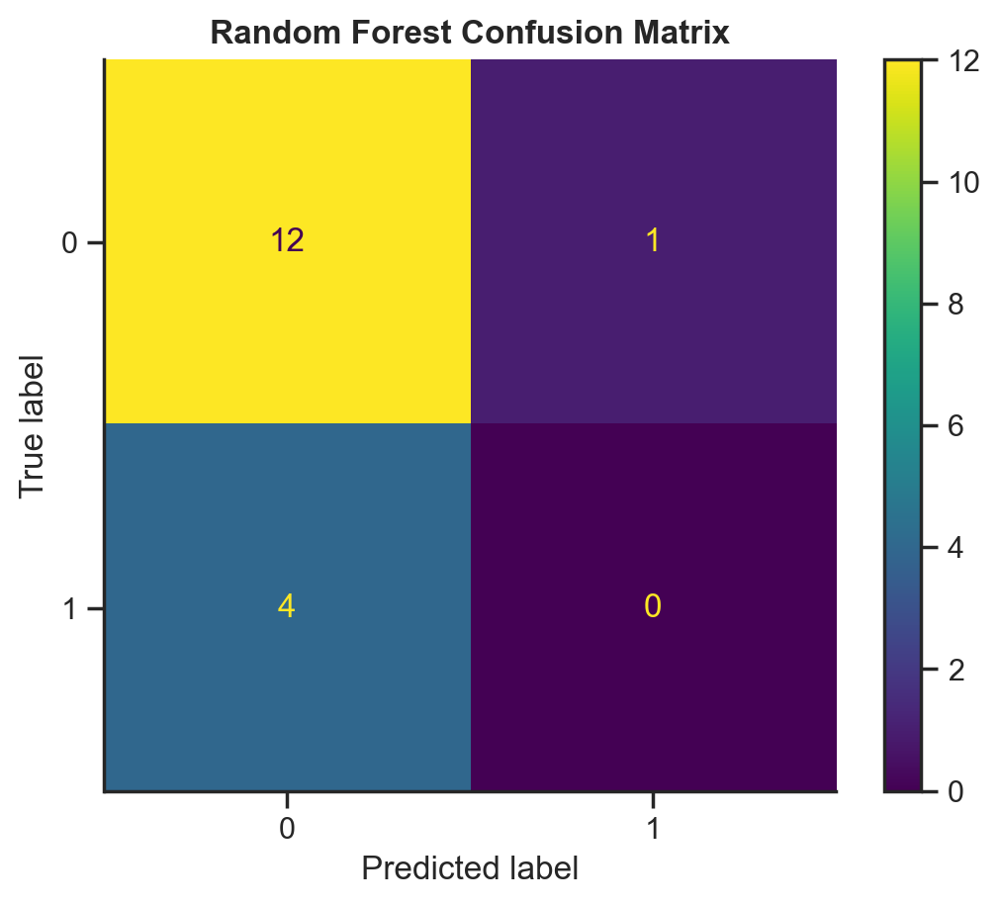
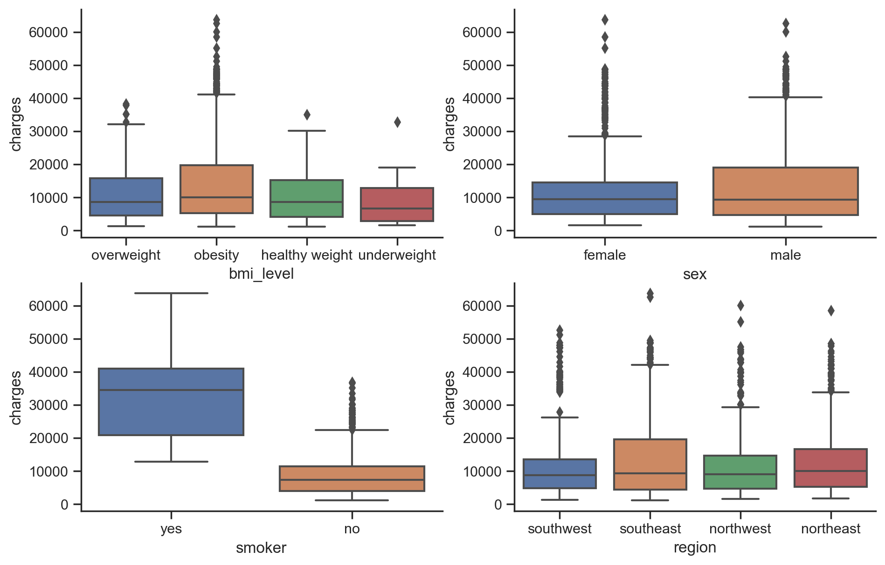
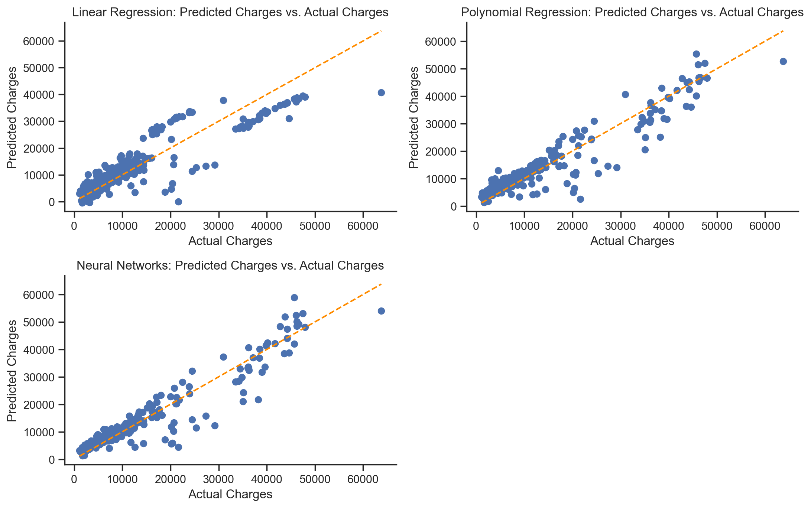

#  My Machine Learning Notebook

## 1. [How to Find the Optimal K for K-Means](https://github.com/eeliuqin/machine-learning/blob/main/how-to-find-optimal-k-k-means.ipynb)
### Content
The post shows 2 methods for finding the optimal number of clusters in K-Means, the Elbow Method and Silhouette Analysis.

## 2. [Kyphosis Disease Classification](https://github.com/eeliuqin/machine-learning/blob/main/kyphosis-disease-classification.ipynb)
### Task
Predicting whether a child will have Kyphosis after surgery, based on his/her age, the number of vertebrae involved, and the number of the topmost vertebra operated on.
### Models
Logistic Regression, Decision Tree, Random Forest.
### Data Visualization
**EDA**

    

**Predicted Charges vs. Actual Charges**

    
    &nbsp;
    
    &nbsp;
    
    &nbsp;

### Result
The highest accuracy 76% is from Logistic Regression classifier with customized threshold.

## 3. [Health Insurance Cost Prediction](https://github.com/eeliuqin/machine-learning/blob/main/medical-insurance-prediction.ipynb)
### Task
Predicting health insurance cost of individuals based on their age, gender, BMI, smoking habit, number of children, and geolocation.
### Models
Linear Regression, Polynomial Regression, Neural Networks.
### Data Visualization
**EDA**

  

**Predicted Charges vs. Actual Charges**

  

### Result
The highest adjusted R^2 0.893 and lowest MSE and MAE are from Neural Networks. 
